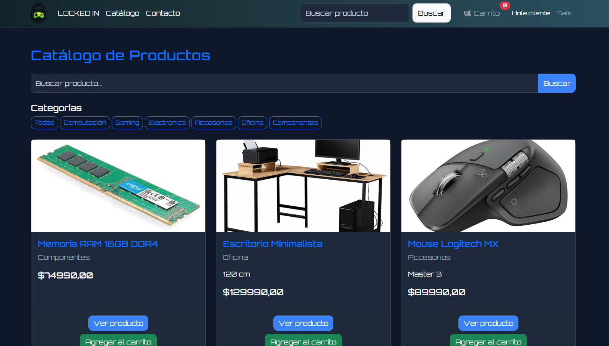
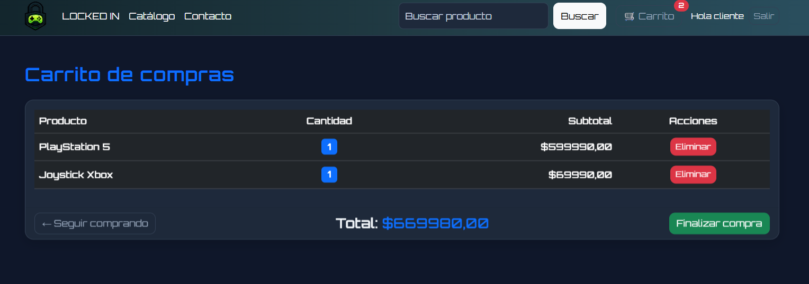

# Ecommerce Web con Django

Este proyecto es una aplicación web de **e-commerce** desarrollada con **Python y Django**.
La idea principal es tener una tienda simple donde los usuarios puedan ver productos, agregarlos a un carrito y realizar una compra dentro del sitio.

El proyecto fue desarrollado como parte del aprendizaje de desarrollo web, integrando backend con Django, frontend con HTML y Bootstrap, manejo de base de datos y autenticación de usuarios.

---

## Tecnologías utilizadas

* Python 3
* Django
* PostgreSQL
* HTML5
* Bootstrap 5
* JavaScript básico
* Git / GitHub

---

## Funcionalidades

### Catálogo de productos

Los usuarios pueden ver los productos disponibles en la tienda.
También es posible:

* filtrar productos por categoría
* buscar productos por nombre

---

### Detalle de producto

Cada producto tiene su propia página donde se muestra:

* imagen
* descripción
* precio
* botón para agregar el producto al carrito

---

### Carrito de compras

El carrito permite:

* agregar productos
* ver los productos seleccionados
* calcular automáticamente el total
* eliminar productos del carrito

El carrito se guarda utilizando **sesiones de Django**.

---

### Autenticación de usuarios

El proyecto utiliza el sistema de autenticación incluido en Django para permitir:

* registro de nuevos usuarios
* inicio de sesión
* cierre de sesión

Cuando un usuario inicia sesión, su nombre aparece en la barra de navegación.

---

### Checkout protegido

La página de **checkout** solo puede ser accedida por usuarios que hayan iniciado sesión.

Si alguien intenta acceder sin estar autenticado, será redirigido automáticamente al login.

---

## Credenciales de prueba

Para facilitar la evaluación, puedes utilizar las siguientes cuentas:

- Rol: administrador
- Usuario: admin
- Contraseña: 5tgb6yhn!"

- Rol: cliente
- Usuario: cliente
- Contraseña: 4rfv5tgb!"

---

## Estructura del proyecto

config/
catalogo/
products/
templates/
static/
media/
manage.py

* **catalogo**: vistas principales del sitio (home, carrito, checkout, contacto)
* **products**: modelos de productos y categorías
* **templates**: plantillas HTML del proyecto
* **static**: archivos estáticos como CSS, imágenes y JS

---

## Instalación

1. Clonar el repositorio

```
git clone https://github.com/usuario/ecommerce
```
3. Crear y activar el entorno virtual:

```
python -m venv venv
venv\Scripts\activate
```

3. Instalar dependencias

```
pip install -r requirements.txt
```

4. Ejecutar migraciones

```
python manage.py migrate
```

5. Iniciar el servidor

```
python manage.py runserver
```

6. Abrir en el navegador

```
http://127.0.0.1:8000
```

---

## Vista previa del proyecto

---
### Catálogo


---
### Carrito


---
### Panel de administración


---

## Rutas principales

Home
`/`

Catálogo
`/catalogo/`

Login
`/accounts/login/`

Registro
`/registro/`

Carrito
`/catalogo/carrito/`

Checkout (requiere login)
`/catalogo/checkout/`

---

## Autor

Hermes Donoso
